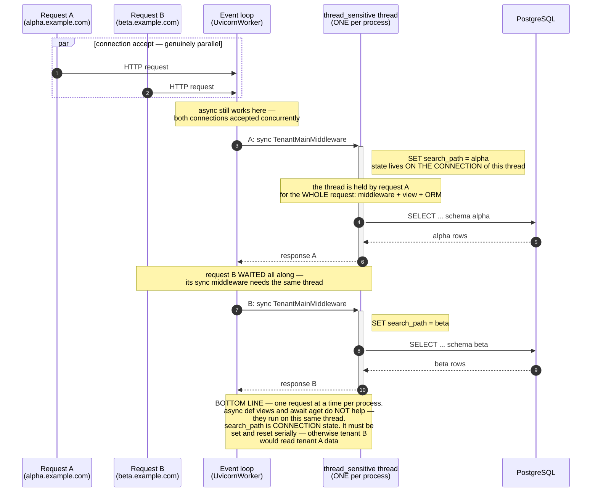

# tenants_back

Multi-tenant Django/DRF backend with multi-database (sharded) architecture.
Each business tenant lives in its own PostgreSQL schema on a designated
Aurora cluster (shard). The public schema on the `default` database holds
the tenant registry, shards, domains, and platform admin users.

## Initialization from scratch

Most of the work is automated by the scripts in `deploy/` and the custom
management commands; only two steps are genuinely manual. The sequence below is
**what you do → which command → what you should see**. The `[type]` column says
whether a step is *manual*, runs one of *our scripts*, a single *command*, or a
*verify* check. Run from one backend host
(`cd /home/ubuntu/tenants_back && source venv/bin/activate`) unless noted.

> **Prerequisite:** AWS infrastructure exists and the backend host is provisioned
> — packages, venv, nginx, gunicorn — by `deploy/user_data_backend.sh` (runs
> automatically on first boot) or by hand. See [Step 1](#step-1---aws-infrastructure-terraform--console).

| # | Step | Type | Command | Expected result | Details |
|---|---|---|---|---|---|
| 1 | Check the 3 databases exist & are reachable | **manual** | `psql -h $HOST -U postgres -c '\l'` (per cluster) | `tenants_back` is listed on each Aurora cluster (if missing, create it + PostGIS + app role) | [Step 2](#step-2---aurora-preparation-one-time) |
| 2 | Fill in & place `settings_local.py` | **manual** | copy `settings_local.py.example`, edit endpoints/secrets, `install -m 600` onto the host | host knows the real per-shard DB/Redis endpoints + secrets | [Secrets](#secrets--credential-distribution) |
| 3 | Generate the tenants migration (one-time) | command | `python manage.py makemigrations tenants` | `tenants/migrations/0001_initial.py` created (commit it) | [Step 3](#step-3---backend-host-bootstrap) |
| 4 | Bootstrap the platform | **script** | `APP_DOMAIN=example.com BOOTSTRAP_ADMIN_PASSWORD=… bash deploy/bootstrap.sh` | script auto-runs: PostGIS → `migrate_schemas --shared` → `sync_shards --activate` → public `Tenant`+`Domain` → `admin` user. Ends with `Bootstrap complete.` | [Step 3](#step-3---backend-host-bootstrap) |
| 5 | Smoke-test the host, then DNS/TLS | verify | `curl -s http://localhost/api/health/` then `curl -I https://example.com/api/health/` | `ok`, then `200 OK`; admin login loads over HTTPS | [Step 4](#step-4---dns-and-tls-verification) |
| 6 | Provision the first tenant | script + manual | add `Tenant`+`Domain` in admin, then `python manage.py migrate_schemas --schema_name=acme` | `OK   acme -> active` (schema auto-created + migrated, `NEW`→`ACTIVE`) | [Step 5](#step-5---first-business-tenant) |
| 7 | Create + verify the tenant admin | verify | `curl -X POST https://acme.example.com/api/auth/login/ -d '{"username":"acme_admin","password":"…"}'` | JWT `{access, refresh, role:"company_admin", schema:"acme"}` | [Step 5](#step-5---first-business-tenant) |

So the only hands-on work is **#1 (check the DBs)** and **#2 (edit
`settings_local.py`)**; from #3 onward the scripts and management commands do the
rest.

> **What happens under the hood:** for the mechanics behind each DB step —
> cluster topology, per-shard roles, the migration order and why it matters, the
> router/`allow_migrate` guarantees, the atomic status claim, connection
> sizing — see **[deploy/DATABASE_SETUP.md](deploy/DATABASE_SETUP.md)**.

**Ongoing operations:** code deploys → [Step 7](#step-7---application-deploy-procedure-for-code-updates) · add a shard → [Step 8](#step-8---adding-a-new-shard) · post-deploy checks → [Step 9](#step-9---operational-verification-post-deploy) · disaster recovery → [Step 10](#step-10---disaster-recovery-quick-reference).

**Background / config reference:** [DB initialization internals](deploy/DATABASE_SETUP.md) · [Secrets distribution](#secrets--credential-distribution) · [Redis / ElastiCache](#redis--elasticache) · [design decisions](#key-design-decisions) · [status state machine](#status-state-machine) · [management commands](#management-commands).

## Stack

- Django 5.2 (LTS)
- django-tenants 3.10
- DRF + SimpleJWT (auth)
- psycopg 3
- PostGIS (GIS models on tenants)
- django-redis (cache + sessions)
- gunicorn `sync` (prefork) workers over WSGI (one request per process)
- nginx (static + reverse proxy via unix socket)
- AWS: ALB + EC2 + Aurora PostgreSQL + ElastiCache Redis

## Architecture overview

```
                       Internet
                          |
                          v
                        AWS ALB  (TLS termination, path-based routing)
                          |
       ----+--------------+--------------+----
           |                             |
           v                             v
     frontend EC2                  backend EC2 x 2
     (nginx + SPA)                 (nginx + gunicorn unix socket)
                                          |
              +---------------------------+---------------------------+
              |                           |                           |
              v                           v                           v
        Aurora "default"           Aurora "tenant_1"           Aurora "tenant_2"
        (public schema:            (tenant schemas:            (tenant schemas:
         Shard, Tenant,             acme, beta, ...)            globex, widgets, ...)
         Domain, User-public,
         Sessions)

                       ElastiCache Redis
                       (app cache + sessions)
```

ALB routing:

- `/api/*`, `/admin/*`         -> backend target group (gunicorn)
- `/static/*`                  -> backend target group (nginx serves Django collectstatic)
- `/`, `/style.css`, `/js/*`   -> frontend target group (nginx serves SPA)

## Key design decisions

| Decision | Rationale |
|---|---|
| Each business tenant assigned to a `Shard` (FK on Tenant) | Routes ORM queries to the correct Aurora cluster |
| `default` database hosts only the public schema | Prevented at multiple layers: form, model.clean, router, commands |
| Status state machine on Tenant (new/pending/active/deactivated/failed) | Visibility of provisioning and migration state |
| Atomic claim via `UPDATE ... WHERE status IN (...)` | Prevents concurrent migration on same tenant |
| Manual reconcile only (no watchdog, no retry) | Admin decides recovery, no false positives |
| `tenants` app listed BEFORE `django_tenants` in SHARED_APPS | Our `migrate_schemas` overrides the upstream version |
| Two AdminSite instances | `public_admin_site` on apex (manage tenants), `admin.site` on subdomains (business data) |
| Two sync middlewares for routing (`ShardAwareTenantMiddleware` + `TenantShardRoutingMiddleware`) | Wires BOTH axes: `current_db` (which shard DB the router uses) AND the tenant schema on that shard connection, with per-request reset. Sync because the schema must be set on the same connection/thread the ORM uses |
| Sync `sync` (prefork) workers, not ASGI | Simplest correct model for sync code + django-tenants; async gives no win with the required sync middleware (see Architecture trade-offs) |
| Schema-bound JWT (`SchemaBoundJWTAuthentication`) | JWTs carry a `schema` claim; auth rejects a token whose claim ≠ the request's tenant. Without it, a token for `user_id=N` in one tenant authenticates as a different person (same PK) in another. Fail-closed |
| `auto_create_schema = False` | Schema creation is explicit; done as part of `migrate_schemas` for NEW tenants |

## Status state machine

```
                  Tenant created (admin)
                          |
                          v
                       [NEW]
                          |
                          | migrate_schemas (claim)
                          v
                      [PENDING]
                       /      \
                      /        \
               (success)    (failure)
                    /            \
                   v              v
              [ACTIVE]         [FAILED]
                |   ^               |
   admin action |   | migrate_      | admin sets to NEW for retry
                v   | schemas       |
          [DEACTIVATED]              v
                ^                  [NEW]
                |
                | reconcile_tenants only
                | flips PENDING <-> ACTIVE/DEACTIVATED based on real state
```

Migratable statuses: `NEW`, `ACTIVE`, `DEACTIVATED`. Each migration run claims
status -> `PENDING` (atomic), runs migrations, then sets back to previous (or
`ACTIVE` if was `NEW`) on success, or `FAILED` on error.

## Management commands

| Command | Purpose |
|---|---|
| `migrate_schemas --shared --database=default` | Apply SHARED_APPS migrations to default.public |
| `migrate_schemas --schema_name=acme` | Provision/migrate a single tenant; auto-creates schema for NEW |
| `migrate_schemas --tenant [--database=X]` | Iterate all tenants (optionally restricted to one shard) |
| `migrate_schemas` (no flags) | Both SHARED and TENANT migrations end-to-end |
| `migrate_schemas --schema_name=acme orders 0010` | Roll forward/back specific app migrations for one tenant |
| `sync_shards [--activate]` | Create Shard records for aliases declared in `settings.DATABASES` |
| `create_tenant_schema <name>` | Explicit `CREATE SCHEMA` without migrations (DBA / restore use) |
| `reconcile_tenants` | Reconcile `Tenant.status` with actual migration state (manual recovery) |
| `reconcile_tenants --report` | Read-only status table for all tenants |

## Two-site admin

- `https://example.com/admin/` -> `public_admin_site`
  Shards, Tenants, Domains, Users (tenant_admin), Groups.
- `https://acme.example.com/admin/` -> `admin.site` (default Django)
  Business models: Cars, Drivers, Customers, Products, Orders, Routes, Users (company/customer/driver).

The same `User` model is registered on both sites; each schema has its own
`auth_user` table.

## Frontend contract

- `POST /api/auth/login/` returns `{access, refresh, role, schema}`.
- JWT claims: `role`, `schema`, `username`, `user_id`.
- Roles: `tenant_admin` (public host only), `company_admin`, `customer`, `driver`
  (tenant hosts only).

## Secrets & credential distribution

Production secrets are the per-shard database credentials (`HOST`/`USER`/
`PASSWORD` for each Aurora cluster) plus Django's `SECRET_KEY`. They live only
in `settings_local.py`, which is gitignored. Each Aurora cluster has its **own**
application role and password, so a leaked credential for one shard cannot reach
another.

### MVP: manual distribution (default)

For the MVP we author and copy `settings_local.py` by hand:

1. Copy `tenants_back/settings_local.py.example` to `settings_local.py` and fill
   in the real endpoints + per-shard passwords (see `settings_local.py.example`
   for the `_AURORA_DEFAULTS` pattern; it uses `_aurora_db_options()` for
   verify-full TLS against the vendored CA at `deploy/certs/`).
2. Copy it to each backend host, readable only by the service user:
   ```bash
   scp settings_local.py backend-1:/tmp/
   ssh backend-1 'sudo install -o ubuntu -g ubuntu -m 600 \
       /tmp/settings_local.py \
       /home/ubuntu/tenants_back/tenants_back/settings_local.py && \
       rm /tmp/settings_local.py'
   ```
3. Restart gunicorn so it picks up the file.

Keep the master copy in your team's password manager.

### Production hardening: SSM Parameter Store (recommended)

Manual copying is fine for one or two hosts, but it doesn't scale and leaves the
secrets in a file you pass around. For production — and **mandatory** with an
Auto Scaling Group, where hosts boot with no human in the loop — store the
secrets in AWS SSM Parameter Store and have each instance fetch them at first
boot. Nothing in the application code changes; only where `settings_local.py`
comes from.

1. **Store one parameter per secret** (`SecureString` = KMS-encrypted at rest):
   ```bash
   aws ssm put-parameter --type SecureString --name /tenants/django_secret       --value "$(openssl rand -hex 50)"
   aws ssm put-parameter --type String       --name /tenants/default/db_user      --value 'tenants_app_default'
   aws ssm put-parameter --type SecureString --name /tenants/default/db_password  --value '<default-secret>'
   # ... repeat for tenant_1, tenant_2
   ```
   Layout:
   ```
   /tenants/django_secret                       (SecureString)
   /tenants/default/db_user      /tenants/default/db_password
   /tenants/tenant_1/db_user     /tenants/tenant_1/db_password
   /tenants/tenant_2/db_user     /tenants/tenant_2/db_password
   ```
2. **Grant the backend EC2 IAM role** `ssm:GetParameter` (and `kms:Decrypt`)
   scoped to `arn:aws:ssm:<region>:<account>:parameter/tenants/*`. No AWS access
   keys are baked into the host — the instance authenticates via its attached
   role.
3. **Fetch at boot**: `deploy/user_data_backend.sh` already does this — for each
   name it calls `aws ssm get-parameter --with-decryption` and writes
   `settings_local.py`. Adopting SSM means dropping the manual step above and
   running that script as EC2 user-data; provisioning becomes hands-off.

## Redis / ElastiCache

**One** ElastiCache cluster, for the single Django cache (`default`) that holds
the app cache + Django sessions.

| Django cache | `maxmemory-policy` | Holds |
|---|---|---|
| `default` | `allkeys-lru` | app cache + Django sessions |

`allkeys-lru` is fine — it's a disposable cache, and sessions also persist in
the DB (`SESSION_ENGINE = cached_db`), so an evicted/cold cache only costs a DB
read, never a logout. There is **no** tenant-routing cache: tenant resolution
goes through the DB each request (`ShardAwareTenantMiddleware`), exactly like
stock django-tenants. (An earlier design cached host→shard in a second,
`noeviction` cluster; it was removed — the routing middleware no longer reads a
cache, so a single cluster is all that's needed.)

### Wiring

```python
# settings_local.py — production points the cache at the cluster:
CACHES["default"]["LOCATION"] = "redis://tenants-app.xxx.cache.amazonaws.com:6379/0"
```

`maxmemory-policy` is configured on the cluster's **parameter group**, not in
application code. The dev default in `settings.py` is a localhost Redis.

## Health checks under load (known consideration)

> **Not implemented for the MVP** — the current `health` view is synchronous.
> Revisit before production / fan-out load. This section records the issue and
> the fix so it isn't forgotten.

The ALB target health check hits `/api/health/`, proxied through nginx to
gunicorn. `tenants/views.py:health` is a **synchronous** Django view, and we run
**sync (prefork) workers — one request per process**. Under heavy load, if all
`NUM_WORKERS` processes on a host are busy with slow requests, the health request
**waits in gunicorn's listen backlog**. If that wait exceeds the health-check
timeout (the `/api/health/` nginx location also has a tight `proxy_read_timeout
5s`), the ALB marks the target unhealthy:

```
busy (not broken) worker → health request queued > timeout → ALB sees a failure
  → target pulled from rotation → its load shifts to the remaining targets
  → they saturate and flap too → cascade; if all flap → ALB fails open
```

A merely *busy* host gets evicted, which makes things worse. This is
health-check flapping.

**Liveness vs readiness.** The ALB check should be a cheap **liveness** probe
("is the process up"), not a **readiness** one ("is the DB reachable / is there
spare capacity"). Keep it **DB-free** so a brief Aurora hiccup doesn't
cascade-evict every target.

**Recommended hardening (under sync prefork — A + C, optionally B):**

**A. Static liveness from nginx (preferred)** — answer 200 without reaching
gunicorn at all, so a busy worker pool can't block it:
```nginx
location = /healthz { access_log off; return 200 "ok\n"; }
```
Point the ALB check at `/healthz`. Immune to app saturation, but shallow — a
dead gunicorn behind a live nginx still passes (pair with C / a deeper out-of-band
check). Note: an `async def` health view does **not** help here — sync prefork
workers have no event loop; that option only applies on the async path.

**B. Worker headroom** — size `NUM_WORKERS` so the health probe almost always
finds a free process, and keep heavy/slow work out of the web tier (→ Celery),
so workers don't all sit busy at once.

**C. Loosen ALB health-check thresholds** so transient load ≠ unhealthy:
require several consecutive failures (`UnhealthyThresholdCount`), reasonable
`HealthCheckTimeoutSeconds` / `HealthCheckIntervalSeconds`, `Matcher = 200`. If
keeping the proxied sync view, also raise the `proxy_read_timeout` on the
`/api/health/` nginx location above its current `5s`.

See the *Worker model* note in `tenants_back/settings.py` and Architecture
trade-offs below.

## Python runtime (pyenv + Python 3.10)

We pin the interpreter to **Python 3.10 via pyenv** instead of the distro's
system Python, so the version is reproducible across dev and all backend hosts
and independent of OS upgrades. Run everything below as the **`ubuntu`** service
user.

> Note: the runbook's `deploy/user_data_backend.sh` currently `apt`-installs
> system Python 3.12. Switching to pyenv + 3.10 means replacing that step with
> the procedure here.

### 1. System build dependencies (to compile CPython)

pyenv builds Python from source, so the host needs the standard build toolchain
and headers ([pyenv wiki "Suggested build environment"](https://github.com/pyenv/pyenv/wiki#suggested-build-environment)):

```bash
sudo apt-get update
sudo apt-get install -y \
    make build-essential libssl-dev zlib1g-dev libbz2-dev \
    libreadline-dev libsqlite3-dev wget curl llvm libncursesw5-dev \
    xz-utils tk-dev libxml2-dev libxmlsec1-dev libffi-dev liblzma-dev git
```

### 2. Project runtime system libraries

Separate from the build toolchain — these are needed at **runtime** by the app
(GIS / `django.contrib.gis` + PostGIS) and the web tier:

```bash
sudo apt-get install -y binutils libproj-dev gdal-bin libgeos-dev nginx supervisor
```

(`psycopg[binary]` in `requirements.txt` ships its own libpq, so `libpq-dev` is
**not** required. If you ever switch to source `psycopg`, add `libpq-dev`.)

### 3. Install pyenv

```bash
curl -fsSL https://pyenv.run | bash
```

Add the init lines to `~/.bashrc` (or `~/.profile`) and reload the shell:

```bash
export PYENV_ROOT="$HOME/.pyenv"
[[ -d $PYENV_ROOT/bin ]] && export PATH="$PYENV_ROOT/bin:$PATH"
eval "$(pyenv init -)"
```

### 4. Install the interpreter

```bash
pyenv install --list | grep -E '^\s*3\.10\.'   # check the latest 3.10.x patch
pyenv install 3.10.14                           # use the latest 3.10 patch
```

### 5. Pin it for the project and create the virtualenv

```bash
cd /home/ubuntu/tenants_back
pyenv local 3.10.14            # writes .python-version → `python` now resolves to 3.10
python -m venv venv            # the venv inherits pyenv's 3.10
venv/bin/pip install -U pip
venv/bin/pip install -r requirements.txt
```

### Why this is runtime-safe for supervisor/systemd

supervisor and systemd launch gunicorn via the venv's **absolute** interpreter
path (`/home/ubuntu/tenants_back/venv/bin/gunicorn` — see `bin/gunicorn_start.sh`
and `deploy/gunicorn.service`). That path embeds the pyenv-built 3.10, so the
running services do **not** depend on pyenv shims or shell init being loaded
(those non-login service shells wouldn't have `eval "$(pyenv init -)"` anyway).
pyenv is only needed to **build and create** the venv.

## Deployment runbook

### Step 1 - AWS infrastructure (Terraform / console)

1. **VPC** with at least two private and two public subnets in two AZs.
2. **Security groups**:
   - `alb-sg`: allow tcp/80 and tcp/443 from `0.0.0.0/0`.
   - `backend-sg`: allow tcp/80 from `alb-sg`; tcp/22 from `bastion-sg`.
   - `frontend-sg`: allow tcp/80 from `alb-sg`; tcp/22 from `bastion-sg`.
   - `aurora-sg`: allow tcp/5432 from `backend-sg`.
   - `redis-sg`: allow tcp/6379 from `backend-sg`.
3. **Three Aurora PostgreSQL clusters**: `tenants-default`, `tenants-tenant-1`,
   `tenants-tenant-2`. Single instance per cluster is OK for MVP
   (`db.t4g.medium`, single-AZ).
4. **One ElastiCache Redis cluster** (`cache.t4g.medium`, `allkeys-lru`) for the
   app cache + Django sessions. See **Redis / ElastiCache** below.
5. **ACM certificate** for `*.example.com` + `example.com`, validated via Route 53 DNS.
6. **Application Load Balancer** with HTTPS listener on :443 using the ACM
   certificate. Two target groups: `backend` (port 80, HTTP) and `frontend`
   (port 80, HTTP). Listener rules:
   - `path-pattern in (/api/*, /admin/*, /static/*)` -> `backend`.
   - default -> `frontend`.
7. **Route 53** alias records for `example.com` and `*.example.com` pointing
   at the ALB.
8. **Secrets**: for the MVP these are distributed manually in
   `settings_local.py` (per-shard DB credentials + `SECRET_KEY`) — see
   **Secrets & credential distribution** above. For the production SSM route,
   create the `/tenants/*` parameters described in that section.
9. **Two backend EC2 instances** (`t4g.medium`) in private subnets, one per AZ.
   Attach to the `backend` target group on port 80. For the MVP, provision the
   host (packages, venv, nginx, gunicorn) and place `settings_local.py`
   manually. For the hands-off SSM route, use `deploy/user_data_backend.sh` as
   user-data and grant the IAM role `ssm:GetParameter` on `/tenants/*`.
10. **One frontend EC2 instance** (set up separately; out of scope for this
    document - this runbook covers backend only).

### Step 2 - Aurora preparation (one-time)

1. From a backend host (or jump box) connect to each Aurora cluster and verify
   connectivity:
   ```bash
   PGPASSWORD=$DB_PASSWORD psql -h $DEFAULT_DB_HOST  -U postgres -d postgres -c '\l'
   PGPASSWORD=$DB_PASSWORD psql -h $TENANT_1_DB_HOST -U postgres -d postgres -c '\l'
   PGPASSWORD=$DB_PASSWORD psql -h $TENANT_2_DB_HOST -U postgres -d postgres -c '\l'
   ```
2. Create the application database in each cluster (if not already created on
   cluster creation):
   ```bash
   for host in $DEFAULT_DB_HOST $TENANT_1_DB_HOST $TENANT_2_DB_HOST; do
       PGPASSWORD=$MASTER_DB_PASSWORD psql -h $host -U postgres -c "CREATE DATABASE tenants_back;"
   done
   ```
3. Create a **per-shard** application role on each cluster (distinct password
   each). The role needs DDL rights because `migrate_schemas` runs
   `CREATE SCHEMA` / `CREATE TABLE` during provisioning:
   ```bash
   # default cluster (repeat with the matching user/password for tenant_1, tenant_2)
   PGPASSWORD=$MASTER_DB_PASSWORD psql -h $DEFAULT_DB_HOST -U postgres -d tenants_back <<'SQL'
   CREATE ROLE tenants_app_default LOGIN PASSWORD '<default-secret>';
   GRANT ALL PRIVILEGES ON DATABASE tenants_back TO tenants_app_default;
   SQL
   ```
   These per-shard credentials are what go into `settings_local.py` (or SSM).

### Step 3 - Backend host bootstrap

1. SSH into one backend host (via bastion or AWS Session Manager).
2. Verify the user-data script completed:
   ```bash
   sudo systemctl status nginx           # should be active
   sudo supervisorctl status gunicorn    # should be RUNNING
   ls /home/ubuntu/tenants_back/staticfiles/admin/   # should not be empty
   ```
3. Place `settings_local.py` (MVP: copy it manually — see **Secrets &
   credential distribution**; SSM route: generated by user-data) and verify it:
   ```bash
   sudo cat /home/ubuntu/tenants_back/tenants_back/settings_local.py
   ```
4. Generate initial migrations for the tenants app (one-time):
   ```bash
   sudo -u ubuntu bash -c "
       cd /home/ubuntu/tenants_back && source venv/bin/activate &&
       python manage.py makemigrations tenants
   "
   ```
   Commit the resulting migration file back to the repo.
5. Run the bootstrap script (only once, on ONE host):
   ```bash
   sudo -u ubuntu bash -c "
       cd /home/ubuntu/tenants_back &&
       APP_DOMAIN='example.com' \
       BOOTSTRAP_ADMIN_PASSWORD='$(openssl rand -base64 18)' \
       bash deploy/bootstrap.sh 2>&1 | tee /tmp/bootstrap.log
   "
   ```
   Record the generated `BOOTSTRAP_ADMIN_PASSWORD` in your secret store
   immediately.
6. Smoke test from the host itself:
   ```bash
   curl -s http://localhost/api/health/                            # -> ok
   curl -s -H "Host: example.com" http://localhost/admin/login/ | head -20
   ```

### Step 4 - DNS and TLS verification

1. Confirm Route 53 records resolve to the ALB:
   ```bash
   dig +short example.com
   dig +short acme.example.com
   ```
2. From the public internet:
   ```bash
   curl -I https://example.com/api/health/        # -> 200 OK
   curl -I https://example.com/admin/login/       # -> 200 OK
   ```
3. Open `https://example.com/admin/` in a browser. Log in as `admin` with the
   bootstrap password.

### Step 5 - First business tenant

1. In the admin (`example.com/admin/`):
   - Go to **Shards**: confirm three rows exist (`default`, `tenant_1`,
     `tenant_2`).
   - Go to **Tenants** -> **Add Tenant**.
     - name: `Acme LLC`
     - schema_name: `acme`
     - shard: pick `tenant_1` (the dropdown only shows non-default active shards).
     - Save.
   - Go to **Domains** -> **Add Domain**.
     - domain: `acme.example.com`
     - tenant: `Acme LLC`
     - is_primary: checked.
     - Save.

2. From a backend host, provision the schema and run migrations:
   ```bash
   sudo -u ubuntu bash -c "
       cd /home/ubuntu/tenants_back && source venv/bin/activate &&
       python manage.py migrate_schemas --schema_name=acme
   "
   ```
   Expected output:
   ```
   === Shard 'tenant_1': 1 tenant(s) eligible ===
     -> Created schema 'acme' on 'tenant_1'
   OK   acme -> active
   ```

3. Create the first `company_admin` for this tenant:
   ```bash
   sudo -u ubuntu bash -c "
       cd /home/ubuntu/tenants_back && source venv/bin/activate &&
       python manage.py shell <<EOF
   from tenants.context import tenant_context
   from tenants.models import Tenant
   from users.models import User

   tenant = Tenant.objects.select_related('shard').get(schema_name='acme')
   with tenant_context(tenant):
       User.objects.create_user(
           username='acme_admin',
           email='admin@acme.example.com',
           password='change-me-too',
           role=User.Role.COMPANY_ADMIN,
       )
       print('OK - company_admin created in acme schema.')
   EOF
   "
   ```

4. Verify:
   ```bash
   curl -s -X POST https://acme.example.com/api/auth/login/ \
       -H "Content-Type: application/json" \
       -d '{"username":"acme_admin","password":"change-me-too"}'
   # Expected: {"refresh":"...","access":"...","role":"company_admin","schema":"acme"}
   ```

5. Open `https://acme.example.com/admin/` in a browser, log in as `acme_admin`.
   You should see Cars, Customers, Drivers, Orders, Products, Routes.

### Step 6 - Second backend host

1. The second EC2 (in another AZ) was bootstrapped by user_data the same way.
   Verify:
   ```bash
   ssh backend-2 'sudo supervisorctl status gunicorn'
   ssh backend-2 'curl -s http://localhost/api/health/'
   ```
2. Confirm ALB shows both targets healthy in the AWS console under `backend`
   target group.

### Step 7 - Application deploy procedure (for code updates)

For each subsequent code release:

1. Pull and install dependencies on each backend host:
   ```bash
   for host in backend-1 backend-2; do
       ssh $host 'sudo -u ubuntu bash -c "
           cd /home/ubuntu/tenants_back &&
           git pull origin main &&
           venv/bin/pip install -q -r requirements.txt &&
           venv/bin/python manage.py collectstatic --noinput
       "'
       ssh $host 'sudo supervisorctl restart gunicorn'
   done
   ```
2. Apply migrations - run from ONE backend host:
   ```bash
   ssh backend-1 'sudo -u ubuntu bash -c "
       cd /home/ubuntu/tenants_back && source venv/bin/activate &&
       python manage.py migrate_schemas --shared --database=default &&
       python manage.py migrate_schemas --tenant
   "'
   ```
   Order matters: SHARED first (in case tenant migrations reference new
   public-side models), then TENANT.
3. Verify state:
   ```bash
   ssh backend-1 'sudo -u ubuntu bash -c "
       cd /home/ubuntu/tenants_back && source venv/bin/activate &&
       python manage.py reconcile_tenants --report
   "'
   ```
   Expected: all tenants `up to date`. Any `behind` means a migration failed -
   inspect with `--schema_name=<X>`.

### Step 8 - Adding a new shard

When you need a fourth Aurora cluster (`tenant_3`):

1. Create the Aurora cluster in AWS. Note its writer endpoint.
2. Create the application database, the PostGIS extension, and a dedicated
   application role (its own password):
   ```bash
   PGPASSWORD=$MASTER_DB_PASSWORD psql -h $TENANT_3_DB_HOST -U postgres -c "CREATE DATABASE tenants_back;"
   PGPASSWORD=$MASTER_DB_PASSWORD psql -h $TENANT_3_DB_HOST -U postgres -d tenants_back -c "CREATE EXTENSION postgis;"
   PGPASSWORD=$MASTER_DB_PASSWORD psql -h $TENANT_3_DB_HOST -U postgres -d tenants_back <<'SQL'
   CREATE ROLE tenants_app_tenant3 LOGIN PASSWORD '<tenant3-secret>';
   GRANT ALL PRIVILEGES ON DATABASE tenants_back TO tenants_app_tenant3;
   SQL
   ```
3. Update `settings_local.py` on every backend host, reusing the
   `_AURORA_DEFAULTS` pattern (verify-full TLS via `_aurora_db_options()`
   against the vendored CA at `deploy/certs/` — do not hard-code the cert path):
   ```python
   DATABASES["tenant_3"] = {
       **_AURORA_DEFAULTS,
       "HOST":     "tenant3.cluster-www.eu-west-1.rds.amazonaws.com",
       "USER":     "tenants_app_tenant3",
       "PASSWORD": "<tenant3-secret>",
   }
   ```
   Restart gunicorn so it picks up the new DATABASES entry.
4. Register the shard:
   ```bash
   python manage.py sync_shards --activate
   ```
   Or via admin: `Shards` -> `Add Shard` -> alias `tenant_3` from dropdown.
5. From now on, when creating tenants in admin, `tenant_3` appears in the
   shard dropdown.

### Step 9 - Operational verification (post-deploy)

1. `reconcile_tenants --report` after every deploy - confirm no `behind` / `failed`.
2. CloudWatch:
   - Target group health (must be `healthy` for both backends).
   - `DatabaseConnections` on each Aurora cluster (should stay well below
     `max_connections`).
   - Redis memory usage; evictions are normal under `allkeys-lru` (disposable cache).
3. Application logs:
   - `/var/log/gunicorn.log`, `/var/log/gunicorn.err.log`
   - `/var/log/nginx/tenants.error.log`

### Step 10 - Disaster recovery quick reference

| Symptom | Command |
|---|---|
| Tenant stuck in PENDING | `reconcile_tenants --only-pending` |
| Want to see current state of every tenant | `reconcile_tenants --report` |
| FAILED tenant after fix | Set `status=NEW` via admin, then `migrate_schemas --schema_name=<name>` |
| Forgot to run migrations after deploy | `migrate_schemas --shared --database=default && migrate_schemas --tenant` |
| Rollback a single tenant | `migrate_schemas --schema_name=<X> --plan <app> <number>` (preview), then drop `--plan` |
| Aurora failover happened | Connections re-establish automatically; check `reconcile_tenants --report` is clean |

## Component summary

| Component | Path | Purpose |
|---|---|---|
| Settings | `tenants_back/settings.py` | Multi-DB, Redis, middleware chain |
| WSGI | `tenants_back/wsgi.py` | gunicorn entry (sync prefork) |
| Public URLs | `tenants_back/urls_public.py` | Apex domain: admin, `/api/tenants/` |
| Tenant URLs | `tenants_back/urls_tenant.py` | Tenant subdomains: admin, business APIs |
| Context | `tenants/context.py` | ContextVar `current_db` + `use_alias` + shard-aware `schema_context`/`tenant_context` (drop-in replacements for the django-tenants ones; also monkeypatched over them in `apps.ready()`) |
| Models | `tenants/models.py` | Shard, Tenant (status FSM), Domain + protections |
| Admin | `tenants/admin.py` | `public_admin_site` + Shard/Tenant/Domain |
| Router | `tenants/routers.py` | TenantSyncRouter + multi-DB guard |
| Middleware | `tenants/middleware.py` | `ShardAwareTenantMiddleware` + `TenantShardRoutingMiddleware` (sync; tenant + shard routing) |
| Views | `tenants/views.py` | TenantViewSet + `health` |
| Commands | `tenants/management/commands/` | `sync_shards`, `create_tenant_schema`, `migrate_schemas`, `reconcile_tenants` |
| Gunicorn | `bin/gunicorn_start.sh` | sync (prefork) workers on unix socket |
| Nginx | `deploy/nginx_backend.conf` | static + `/api/`, `/admin/` via unix socket |
| Supervisor | `deploy/supervisor_gunicorn.conf` | Process management |
| User-data | `deploy/user_data_backend.sh` | First-boot setup |
| Bootstrap | `deploy/bootstrap.sh` | One-time platform bootstrap |

## Architecture trade-offs & open questions

Some concerns can't be fixed in one file with one setting — they are emergent
properties of the **worker model and where work runs**, so resolving them is an
architectural decision that spans several layers. They are listed here (rather
than buried in a code comment) precisely because **no single component owns
them**. Both items below share the same root cause: a **synchronous request
model on a finite pool of prefork worker processes** (one request per process).
The async path (UvicornWorker) is intentionally not used — with our required
sync tenant/shard middleware it gives no concurrency win (see the *Worker model*
note in `tenants_back/settings.py`).

#### Why the async path gives no win here (illustration)

Two concurrent requests under UvicornWorker + the (required) sync tenant
middleware: the event loop accepts both, but **processing serializes on the
single thread-sensitive thread**, because the tenant schema (`search_path`) is
**per-connection state** that must be set/reset serially:



The same as a timeline — expectation vs reality vs the prefork model we chose:

```mermaid
gantt
    title 3 concurrent requests, 1 process. Each request = 100 ms of work
    dateFormat X
    axisFormat %s
    section The async myth
    Request A : 0, 100
    Request B : 0, 100
    Request C : 0, 100
    section Reality. UvicornWorker + sync tenant middleware
    A processing : active, 0, 100
    B waits for the thread : crit, 0, 100
    B processing : active, 100, 200
    C waits for the thread : crit, 0, 200
    C processing : active, 200, 300
    section Sync prefork. 3 worker processes
    Request A : done, 0, 100
    Request B : done, 0, 100
    Request C : done, 0, 100
```



### Bounding heavy-view request duration

**Status: partially addressed by the sync-prefork move; Celery is the real home.**

Because we run **sync (prefork) workers**, `gunicorn --timeout` now *does* act as
a **blunt per-request hard limit**: a request exceeding it gets its worker process
killed and respawned. That is a wall-clock ceiling we did NOT have under
`UvicornWorker` (where `--timeout` is only a heartbeat and a long request keeps
the event loop alive). Since prefork is 1 request/process, the kill drops only
that one request — clean isolation. Caveats:

- It's **blunt**: SIGKILL after `graceful_timeout`, the client sees a 502 /
  reset, and there's no graceful cleanup.
- PostgreSQL `statement_timeout` is **per statement** — it never trips on many
  individually-fast queries and does nothing for CPU time, so it does NOT bound a
  "hundreds of small queries + CPU math" view. Only `--timeout` (process kill) or
  moving the work out actually bounds such a request.

For *graceful* bounding of genuinely heavy work the answer remains **Celery**
(phase 2): the web request enqueues and returns fast; `task_time_limit` bounds
the task in a separate killable process. A **cooperative deadline** (the hot loop
checks elapsed time and aborts) is the in-process alternative when the work must
stay in the request but you want a clean 504 instead of a 502-on-kill.

**Bottom line:** `--timeout` now caps wall-clock (bluntly); the clean path
(heavy work → Celery) is a deliberate phase-2 step, not a flag.

### Health-check flapping under load

**Status: documented; mitigations not yet wired** — see
[Health checks under load](#health-checks-under-load-known-consideration).

The sync `health` view occupies a worker process; under saturation, if all
`NUM_WORKERS` processes are busy, the probe waits in gunicorn's backlog and the
ALB can evict a *busy-but-healthy* target, cascading load onto the rest (and, if
all flap, failing open). The remedy isn't one line: it spans nginx routing
(`/api/health/` vs a static `/healthz`), ALB threshold tuning, worker headroom,
and the liveness-vs-readiness distinction.

**Why it's not local:** it's a direct consequence of the worker concurrency
model (finite worker processes, sync requests). Any robust fix must be designed
together with how the system sheds and queues load — not bolted onto the health
endpoint alone.
